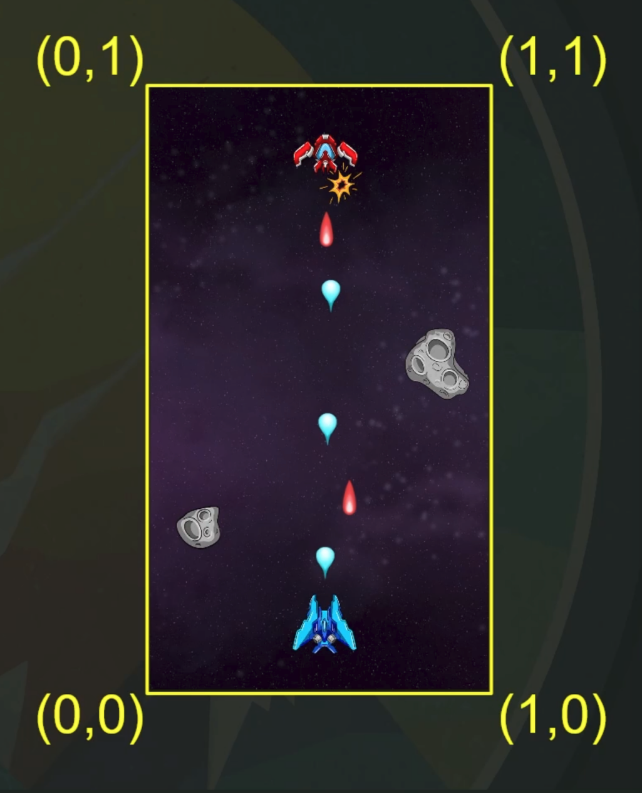
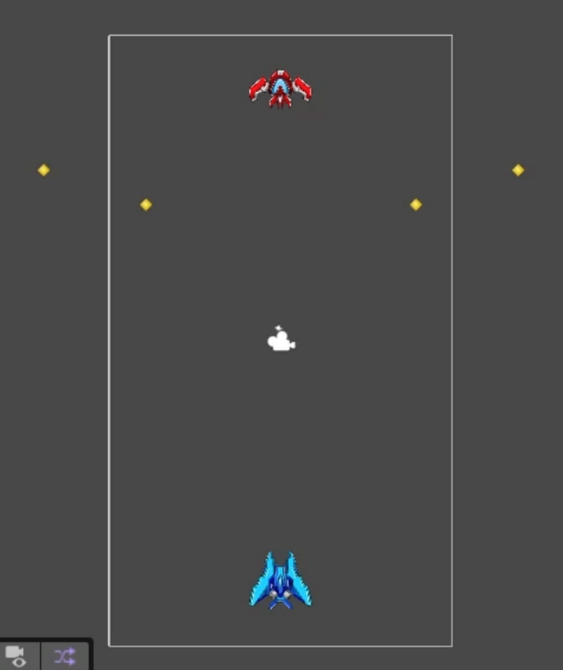
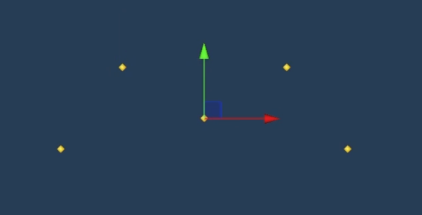

# Star Blaster - Game Development Instructions

A comprehensive guide to creating the Star Blaster game.

---

## Table of Contents

1. [Project Setup](#chapter-1-project-setup)
2. [Setting Up Movements](#chapter-2-setting-up-movements)
3. [Viewport Boundaries](#chapter-3-viewport-boundaries)
4. [Enemy Movement (Enemy Pathfinding)](#chapter-4-enemy-movement-enemy-pathfinding)
   - 4.1 [WaveConfig - ScriptableObject](#41-waveconfig---scriptableobject)
   - 4.2 [Pathfinding - Enemy Movement](#42-pathfinding---enemy-movement)
   - 4.3 [Enemy Spawner - Runtime Instantiation](#43-enemy-spawner---runtime-instantiation)
   - 4.4 [Time Between Enemy Spawns - Coroutines](#44-time-between-enemy-spawns---coroutines)
   - 4.5 [Looping Waves - Endless Gameplay](#45-looping-waves---endless-gameplay)
5. Health and Damage *(Coming Soon)*
   - 5.1 Health Scripts and Taking Damage
   - 5.2 Projectile Setup
   - 5.3 Player Shooting
   - 5.4 Enemy Shooting
6. Environmental Effects *(Coming Soon)*
   - 6.1 Scrolling Backgrounds
   - 6.2 Explosion Particle Effects
   - 6.3 Screen Shake

---

## Chapter 1: Project Setup

This chapter covers the initial setup of the Star Blaster project, including Unity configuration, editor layout customization, asset organization, and introduction to prefabs.

### Unity Version and Core

- **Unity Version**: Unity v6
- **Render Pipeline**: Universal 2D Pipeline

### Layout Setup

Since Unity does not have a built-in vertical layout and we will be creating a vertical game, we need to create a custom layout:

1. Select the **Tall Layout** as your starting point
2. Arrange the **Game** and **Scene** views side by side
3. Configure the Game view for vertical aspect ratio:
   - Click on the aspect ratio dropdown in the Game view
   - Select the **+** button to add a new aspect ratio
   - Name it **9x16**
   - Change the type from **Fixed Resolution** to **Aspect Ratio**
   - Set **X: 9** and **Y: 16**
4. Save your custom layout:
   - Click the upper right corner dropdown
   - Select **Save Layout**
   - Name it **Vertical**

### Asset Setup

1. Download the sprite folder from the Asset Google Drive
2. Drag the sprite folder into your Unity project folder
3. Create two empty GameObjects:
   - Right-click in the Hierarchy and select **Create Empty**
   - Name the first one **Player**
   - Name the second one **Enemy**
4. Reset their transforms:
   - Select each GameObject
   - In the Inspector, click the gear icon on the Transform component
   - Select **Reset**
5. Add sprites as children:
   - Drag the player sprite from the project folder onto the Player GameObject
   - Drag the enemy sprite from the project folder onto the Enemy GameObject
6. Resize objects (demonstrating different resize methods):
   - Select the **Main Camera**
   - Set the **Size** property to **9**
   - Select the sprite GameObjects (children)
   - Set their **Scale** to **130** in the Transform component
7. Ensure sprite transforms are reset:
   - Select each sprite child GameObject
   - Reset their Transform component (position should be at origin relative to parent)

### Prefabs

**What are Prefabs?**

Prefabs are reusable GameObject templates in Unity. Think of them as blueprints that allow you to create multiple instances of the same object throughout your game. Any changes made to the prefab will automatically update all instances in your scenes, making them essential for efficient game development.

**Why use Prefabs?**
- Create multiple copies of the same object with consistent properties
- Update all instances at once by modifying the prefab
- Perfect for enemies, projectiles, UI elements, and other repeating objects
- Maintain consistency across your game

**Creating Prefabs:**

1. Create a **Prefabs** folder in your Project window:
   - Right-click in the Assets folder
   - Select **Create > Folder**
   - Name it **Prefabs**
2. Convert GameObjects to Prefabs:
   - Drag the **Player** GameObject from the Hierarchy into the Prefabs folder
   - Drag the **Enemy** GameObject from the Hierarchy into the Prefabs folder
3. The GameObjects in the Hierarchy will now be highlighted in blue, indicating they are prefab instances

---

## Chapter 2: Setting Up Movements

This chapter covers implementing player movement using Unity's new Input System, without relying on physics components.

### Important Note

We will **not** be using Rigidbody components for this game. Since we don't require physics systems and just want to move the player around directly, we'll manipulate the Transform component instead.

### Creating the PlayerController Script

1. Create a new C# script:
   - Right-click in the Project window
   - Select **Create > C# Script**
   - Name it **PlayerController**
2. Attach the script to the Player GameObject in the Hierarchy

### Setting Up the Input System

Before coding, verify that you have the **InputSystem_Actions** asset in your project folder. This contains the pre-configured input actions we'll be using.

### Implementing Movement - Step by Step

Open the **PlayerController** script and follow these steps:

#### Step 1: Add Required Using Statements

```csharp
using UnityEngine;
using UnityEngine.InputSystem;
```

The `UnityEngine.InputSystem` namespace is required to access the new Input System.

#### Step 2: Declare Variables

```csharp
public class PlayerController : MonoBehaviour
{
    InputAction moveAction;

    Vector2 moveVector;
}
```

- `moveAction`: Reference to the input action for movement
- `moveVector`: Stores the current movement direction

#### Step 3: Initialize the Input Action

```csharp
void Start()
{
    moveAction = InputSystem.actions.FindAction("Move");
}
```

In `Start()`, we find and store a reference to the "Move" action from our InputSystem_Actions asset.

#### Step 4: Call Movement in Update

```csharp
void Update()
{
    MovePlayer();
}
```

#### Step 5: Implement Basic Movement

```csharp
void MovePlayer()
{
    moveVector = moveAction.ReadValue<Vector2>();

    transform.position += moveVector;
}
```

**Problem #1: Type Mismatch Error**

Try to compile and run the game. You'll get an error! The error occurs because:
- `moveAction.ReadValue<Vector2>()` returns a **Vector2** (only X and Y)
- `transform.position` is a **Vector3** (X, Y, and Z)
- You can't directly add a Vector2 to a Vector3

**Solution 1: The Explicit Way**

Update the `MovePlayer()` method to explicitly convert Vector2 to Vector3:

```csharp
void MovePlayer()
{
    Vector2 input = moveAction.ReadValue<Vector2>();

    moveVector = new Vector3(input.x, input.y, 0f);

    transform.position += moveVector;
}
```

This works! We manually create a new Vector3 using the X and Y from our input, and set Z to 0 (since we're in 2D).

**Solution 2: The Shortcut**

There's a cleaner way! Go back to Step 2 and change the variable declaration:

```csharp
Vector3 moveVector;  // Changed from Vector2 to Vector3
```

Now simplify your `MovePlayer()` method back to:

```csharp
void MovePlayer()
{
    moveVector = moveAction.ReadValue<Vector2>();

    transform.position += moveVector;
}
```

This works because C# automatically converts Vector2 to Vector3 when you assign it, setting Z to 0 automatically. Much cleaner!

**Challenge Time!**

Now run the game and try moving the player. What happens? The player will fly across the screen uncontrollably!

This happens because we're adding the input values directly to the position every frame without any speed control or frame-rate independence.

#### Step 6: Fix the Movement Speed (After Experiencing the Problem)

First, add a new variable at the top of your class:

```csharp
public class PlayerController : MonoBehaviour
{
    [SerializeField] float moveSpeed = 10f;  // Add this line

    InputAction moveAction;

    Vector3 moveVector;  // Make sure this is Vector3 (the shortcut from Step 5)
}
```

Then update the `MovePlayer()` method:

```csharp
void MovePlayer()
{
    moveVector = moveAction.ReadValue<Vector2>();

    transform.position += moveVector * moveSpeed * Time.deltaTime;
}
```

**What changed?**
- `moveSpeed`: A new variable that multiplies the movement by our speed value (10f), giving us control over how fast the player moves. The `[SerializeField]` attribute makes it adjustable in the Inspector.
- `Time.deltaTime`: Makes movement frame-rate independent by accounting for the time between frames. Without this, the player would move faster on high-FPS systems and slower on low-FPS systems

### Final Complete Code

```csharp
using UnityEngine;
using UnityEngine.InputSystem;

public class PlayerController : MonoBehaviour
{
    [SerializeField] float moveSpeed = 10f;

    InputAction moveAction;

    Vector3 moveVector;

    void Start()
    {
        moveAction = InputSystem.actions.FindAction("Move");
    }

    void Update()
    {
        MovePlayer();
    }

    void MovePlayer()
    {
        moveVector = moveAction.ReadValue<Vector2>();

        transform.position += moveVector * moveSpeed * Time.deltaTime;
    }
}
```

### Testing

1. Save your script
2. Return to Unity and let it compile
3. Select the Player GameObject and verify the Move Speed is set to 10 in the Inspector
4. Press Play and use your input (WASD or Arrow keys) to move the player around
5. The player should now move smoothly and at a controlled speed!

---

## Chapter 3: Viewport Boundaries

This chapter covers constraining player movement within the visible game area using Unity's viewport coordinate system. Understanding viewport space is the foundation of this implementation.

### Understanding Viewport Space

**Viewport Space** is a normalized coordinate system that Unity uses to represent positions on the screen, regardless of the actual screen resolution or size. This makes it perfect for setting boundaries that work on any device.

In viewport coordinates:
- The **bottom-left corner** of the screen is **(0, 0)**
- The **bottom-right corner** of the screen is **(1, 0)**
- The **top-left corner** of the screen is **(0, 1)**
- The **top-right corner** of the screen is **(1, 1)**

The coordinates are always between 0 and 1, making them resolution-independent!



*The yellow box shows the viewport boundaries with coordinates labeled at each corner.*

### The ViewportToWorldPoint Function

Unity provides a function called `ViewportToWorldPoint()` that converts viewport coordinates (0-1 range) into world space coordinates (actual positions in your game world).

```csharp
Camera.main.ViewportToWorldPoint(new Vector2(x, y));
```

This is essential because:
- **Viewport coordinates** are normalized (0-1) and screen-relative
- **World coordinates** are actual positions where GameObjects exist
- We need to convert viewport boundaries to world positions to constrain our player

### Our Implementation Strategy

For our boundary system, we only need two key points:
- **(0, 0)** - Bottom-left corner → This gives us our **minimum bounds**
- **(1, 1)** - Top-right corner → This gives us our **maximum bounds**

With these two points converted to world space, we can clamp the player's position to stay within the visible screen area!

### Implementing Boundary Constraints - Step by Step

Open your **PlayerController** script and follow these steps:

#### Step 1: Add Boundary Variables

At the top of your class, add two Vector2 variables to store our boundary positions:

```csharp
public class PlayerController : MonoBehaviour
{
    [SerializeField] float moveSpeed = 10f;

    InputAction moveAction;
    Vector3 moveVector;
    Vector2 minBounds;  // Add this
    Vector2 maxBounds;  // Add this
}
```

These will store the world-space positions of our screen corners.

#### Step 2: Create the InitBounds Method

Add a new method to calculate and store the boundary positions:

```csharp
void InitBounds()
{
    Camera mainCamera = Camera.main;
    minBounds = mainCamera.ViewportToWorldPoint(new Vector2(0, 0));
    maxBounds = mainCamera.ViewportToWorldPoint(new Vector2(1, 1));
}
```

This method:
1. Gets a reference to the main camera
2. Converts viewport point (0, 0) to world position → stored as `minBounds`
3. Converts viewport point (1, 1) to world position → stored as `maxBounds`

#### Step 3: Call InitBounds in Start

Add the `using System;` directive at the top of your file (needed for Math.Clamp), then update your `Start()` method:

```csharp
using System;
using UnityEngine;
using UnityEngine.InputSystem;
```

```csharp
void Start()
{
    moveAction = InputSystem.actions.FindAction("Move");

    InitBounds();  // Add this line
}
```

#### Step 4: Update MovePlayer with Clamping

Replace your `MovePlayer()` method with this updated version:

```csharp
void MovePlayer()
{
    moveVector = moveAction.ReadValue<Vector2>();
    Vector3 newPos = transform.position + moveVector * moveSpeed * Time.deltaTime;

    newPos.x = Math.Clamp(newPos.x, minBounds.x, maxBounds.x);
    newPos.y = Math.Clamp(newPos.y, minBounds.y, maxBounds.y);

    transform.position = newPos;
}
```

**What's happening here?**
1. Calculate the desired new position based on input
2. **Clamp the X position**: Keep it between the left and right boundaries
3. **Clamp the Y position**: Keep it between the bottom and top boundaries
4. Apply the clamped position to the transform

`Math.Clamp(value, min, max)` ensures the value stays within the specified range. If the value goes below min, it returns min. If it goes above max, it returns max.

### Testing Basic Boundaries

1. Save your script and return to Unity
2. Press Play and move the player around
3. The player should now stop at the screen edges!

**But wait...** Do you notice a problem? When the player reaches the edge, part of the sprite might get cut off! The player's pivot point stops at the boundary, but the sprite extends beyond it.

### Adding Padding for Better Control

To fix the clipping issue, we need to add padding that accounts for the sprite's size. This keeps the entire player sprite visible on screen.

#### Step 5: Add Padding Variables

Add these new variables at the top of your class:

```csharp
public class PlayerController : MonoBehaviour
{
    [SerializeField] float moveSpeed = 10f;
    [SerializeField] float leftBoundPadding;
    [SerializeField] float rightBoundPadding;
    [SerializeField] float upBoundPadding;
    [SerializeField] float downBoundPadding;

    InputAction moveAction;
    Vector3 moveVector;
    Vector2 minBounds;
    Vector2 maxBounds;
}
```

#### Step 6: Update MovePlayer with Padding

Update the clamping lines in your `MovePlayer()` method:

```csharp
void MovePlayer()
{
    moveVector = moveAction.ReadValue<Vector2>();
    Vector3 newPos = transform.position + moveVector * moveSpeed * Time.deltaTime;

    newPos.x = Math.Clamp(newPos.x, minBounds.x + leftBoundPadding, maxBounds.x - rightBoundPadding);
    newPos.y = Math.Clamp(newPos.y, minBounds.y + downBoundPadding, maxBounds.y - upBoundPadding);

    transform.position = newPos;
}
```

Now the boundaries are offset by the padding values, preventing the sprite from being clipped!

### Final Complete Code

```csharp
using System;
using UnityEngine;
using UnityEngine.InputSystem;

public class PlayerController : MonoBehaviour
{
    [SerializeField] float moveSpeed = 10f;
    [SerializeField] float leftBoundPadding;
    [SerializeField] float rightBoundPadding;
    [SerializeField] float upBoundPadding;
    [SerializeField] float downBoundPadding;

    InputAction moveAction;

    Vector3 moveVector;
    Vector2 minBounds;
    Vector2 maxBounds;

    void Start()
    {
        moveAction = InputSystem.actions.FindAction("Move");

        InitBounds();
    }

    void Update()
    {
        MovePlayer();
    }

    void InitBounds()
    {
        Camera mainCamera = Camera.main;
        minBounds = mainCamera.ViewportToWorldPoint(new Vector2(0, 0));
        maxBounds = mainCamera.ViewportToWorldPoint(new Vector2(1, 1));
    }

    void MovePlayer()
    {
        moveVector = moveAction.ReadValue<Vector2>();
        Vector3 newPos = transform.position + moveVector * moveSpeed * Time.deltaTime;

        newPos.x = Math.Clamp(newPos.x, minBounds.x + leftBoundPadding, maxBounds.x - rightBoundPadding);
        newPos.y = Math.Clamp(newPos.y, minBounds.y + downBoundPadding, maxBounds.y - upBoundPadding);

        transform.position = newPos;
    }
}
```

### Final Testing with Padding

1. Save your script and return to Unity
2. Select the Player GameObject in the Hierarchy
3. In the Inspector, you'll see four new padding fields
4. Set initial values:
   - **Left Bound Padding**: 1
   - **Right Bound Padding**: 1
   - **Up Bound Padding**: 7
   - **Down Bound Padding**: 3
5. Press Play and try to move the player to the edges
6. The player sprite should now stay fully visible, with no clipping at the screen boundaries!

**Why more padding on top and bottom?**

We're adding extra padding (at least **30% of the screen space**) on the top and bottom boundaries to reserve space for UI elements like:
- Score display
- Health bars
- Power-up indicators
- Level information
- Pause button

This prevents the player from overlapping with important UI elements and keeps the playable area clean and readable.

**Tips:**
- Positive padding values push the boundaries inward (player stays further from edges)
- Zero padding allows the player's pivot to reach the exact screen edge (may cause clipping)
- Top and bottom need more padding than left and right due to UI placement
- Adjust padding values as you add UI elements to ensure nothing overlaps
- Test different values to find the right balance between playable space and UI space

---

## Chapter 4: Enemy Movement (Enemy Pathfinding)

This chapter covers creating an enemy pathfinding system where enemies follow predefined paths through waypoints. We'll build a flexible, data-driven system using ScriptableObjects and multiple specialized scripts.

### System Overview

Our enemy pathfinding system consists of four main components:

1. **Path GameObject Setup** - Visual waypoint system in the scene
2. **WaveConfigSO** (ScriptableObject) - Configuration data for:
   - Which enemy to spawn
   - Which path to follow
   - Time between enemy spawns
   - Enemy movement speed
3. **EnemySpawner** (MonoBehaviour) - Spawning system that:
   - Spawns enemies based on wave configurations
   - Controls the order of waves
   - Manages time between waves
4. **EnemyPathing** (MonoBehaviour) - Movement system that:
   - Moves enemies along the waypoint path
   - Handles smooth movement between waypoints

This separation of concerns makes our system modular, reusable, and easy to modify without changing code.

### Setting Up the Path System

Before we write any scripts, let's create the visual waypoint system that enemies will follow.

#### Step 1: Create the Path GameObject

1. Right-click in the Hierarchy
2. Select **Create Empty**
3. Name it **Path**
4. Reset its Transform (position at origin)

#### Step 2: Create the First Waypoint

1. Right-click on the **Path** GameObject
2. Select **Create Empty**
3. Name it **Waypoint**
4. Position it where you want the enemy path to start (typically at the top of the screen)

#### Step 3: Assign an Icon for Visibility

Before duplicating waypoints, let's make them visible in the Scene view:

1. Select the **Waypoint** GameObject
2. In the Inspector, click the **icon** in the top-left corner (next to the GameObject name)
3. Choose a visible icon (like a yellow diamond or colored circle)
4. This icon will appear in the Scene view, making waypoints easy to see and position

#### Step 4: Create Multiple Waypoints

1. With the Waypoint selected, duplicate it (Ctrl+D / Cmd+D)
2. Position the new waypoint to create your desired path
3. Repeat to create a complete path through the screen
4. The waypoints should go from top to bottom (or follow your desired enemy movement pattern)



*Yellow diamond icons represent waypoints forming the enemy path. The enemy (red ship) will follow these waypoints from top to bottom.*

**Important Notes:**
- Waypoints are ordered by their hierarchy position (first child = waypoint 0, second child = waypoint 1, etc.)
- Plan your path to keep enemies visible and create interesting movement patterns
- You can create multiple Path GameObjects for different enemy movement patterns

---

## 4.1 WaveConfig - ScriptableObject

Now we'll create our first script: **WaveConfigSO**, a ScriptableObject that stores configuration data for enemy waves.

### What is a ScriptableObject?

**ScriptableObject** is a special type of Unity class designed to store data as assets in your project, separate from GameObjects in scenes.

**Key Differences from MonoBehaviour:**

| MonoBehaviour | ScriptableObject |
|---------------|------------------|
| Must be attached to a GameObject in a scene | Exists as a standalone asset file in the Project window |
| Has lifecycle methods (Start, Update, etc.) | No lifecycle methods - just data storage |
| Each GameObject has its own copy of the data | One asset can be referenced by multiple objects |
| Lives in scenes | Lives in your project as a reusable asset |
| Destroyed when the scene unloads | Persists across scenes |

**Why use ScriptableObjects for Wave Configuration?**

- **Data-driven design**: Change enemy waves without modifying code
- **Reusability**: Create multiple wave configurations easily
- **Memory efficient**: Multiple enemies can reference the same configuration
- **Designer-friendly**: Non-programmers can create and modify waves
- **Organization**: Keep all wave data in one place

Think of ScriptableObjects as "configuration files" that Unity can read and use at runtime.

**Other Common Use Cases for ScriptableObjects:**

Beyond wave configurations, ScriptableObjects are incredibly versatile. Here are some other practical applications:

- **Item/Weapon Data**: Store weapon stats (damage, fire rate, ammo), item descriptions, icons, and prices. Create one ScriptableObject per weapon, and all enemies/players that use that weapon reference the same data.

- **Character Stats**: Define different character types with health, speed, abilities. Create a "Tank" character asset, a "Speedster" asset, etc.

- **Game Settings**: Store audio levels, difficulty settings, control schemes that persist and can be easily tweaked by designers.

- **Dialogue Systems**: Each conversation can be a ScriptableObject with text lines, character names, and branching options.

- **Quest Data**: Define quests with objectives, rewards, descriptions, and completion states.

- **Shop Inventories**: Create shop assets that list available items, prices, and stock levels.

In our game, we're using ScriptableObjects for wave configurations, but the same pattern could be applied to power-up definitions, different player ship types, or boss attack patterns!

### Creating the WaveConfigSO Script

#### Step 1: Create the Script

1. Right-click in the Project window
2. Select **Scripting > Create ScriptableObject Script**
3. Name it **WaveConfigSO** (the "SO" suffix indicates it's a ScriptableObject)

#### Step 2: Implement the WaveConfigSO

Open the script and replace all the code with:

```csharp
using UnityEngine;

[CreateAssetMenu(fileName = "WaveConfig", menuName = "New WaveConfig")]
public class WaveConfigSO : ScriptableObject
{
    [SerializeField] Transform pathPrefab;
    [SerializeField] float enemyMoveSpeed = 5f;

    public Transform GetStartingWaypoint()
    {
        return pathPrefab.GetChild(0);
    }

    public float GetEnemyMoveSpeed()
    {
        return enemyMoveSpeed;
    }

    public Transform[] GetWaypoints()
    {
        Transform[] waypoints = new Transform[pathPrefab.childCount];

        for (int i = 0; i < pathPrefab.childCount; i++)
        {
            waypoints[i] = pathPrefab.GetChild(i);
        }

        return waypoints;
    }
}
```

**Code Breakdown:**

- `[CreateAssetMenu]`: Adds a menu item to create WaveConfig assets
  - `fileName`: Default name for new assets (without the "SO" suffix)
  - `menuName`: Where it appears in the Create menu
- `ScriptableObject`: Base class for data container assets
- `pathPrefab`: Reference to the Path GameObject with all waypoints
- `enemyMoveSpeed`: How fast enemies move along the path
- `GetStartingWaypoint()`: Returns the first waypoint (where enemies spawn)
- `GetEnemyMoveSpeed()`: Returns the configured movement speed
- `GetWaypoints()`: Returns an array of all waypoints in order

### Setting Up the Wave Configuration

Now let's organize our assets and create our first wave configuration:

#### Step 1: Create the Paths & Waves Folder

1. In the Project window, right-click in your Assets folder
2. Select **Create > Folder**
3. Name it **Paths & Waves**

This folder will store all our path prefabs and wave configurations in one organized location.

#### Step 2: Create the Path Prefab

1. In the Hierarchy, select your **Path** GameObject (with all its waypoints)
2. Drag it into the **Paths & Waves** folder
3. Rename the prefab to **Path 0**
4. **Delete the Path GameObject from the Hierarchy**

The path is now saved as a prefab and will be instantiated by our spawner system later.

#### Step 3: Create the WaveConfig Asset

1. Right-click in the **Paths & Waves** folder
2. Select **New WaveConfig** (the menu item we created with our script)
3. Name it **Wave 0**

#### Step 4: Configure Wave 0

1. Select the **Wave 0** asset in the Project window
2. In the Inspector:
   - Drag **Path 0** from the Paths & Waves folder into the **Path Prefab** field
   - Set **Enemy Move Speed** to **5** (or adjust as desired)

Perfect! You've now created your first wave configuration. The Wave 0 asset contains all the data needed to spawn and move enemies along Path 0.

You can create multiple path prefabs and wave configurations with different movement patterns and speeds for variety in your game!

---

## 4.2 Pathfinding - Enemy Movement

Now we'll create the **Pathfinding** script, a MonoBehaviour that handles enemy movement along the waypoint path defined in our WaveConfig.

### What Does This Script Do?

The Pathfinding script:
- Reads waypoint data from a WaveConfigSO asset
- Moves the enemy smoothly from waypoint to waypoint
- Destroys the enemy when it reaches the end of the path
- Uses frame-rate independent movement for consistent speed

### Creating the Pathfinding Script

#### Step 1: Create the Script

1. Right-click in the Project window
2. Select **Create > C# Script**
3. Name it **Pathfinding**

#### Step 2: Implement the Pathfinding Script

Open the script and replace all the code with:

```csharp
using UnityEngine;

public class Pathfinding : MonoBehaviour
{
    [SerializeField] WaveConfigSO waveConfig;
    Transform[] waypoints;
    int waypointIndex = 0;

    void Start()
    {
        waypoints = waveConfig.GetWaypoints();
        transform.position = waveConfig.GetStartingWaypoint().position;
    }

    void Update()
    {
        FollowPath();
    }

    void FollowPath()
    {
        if (waypointIndex < waypoints.Length)
        {
            Vector3 targetPosition = waypoints[waypointIndex].position;
            float moveDelta = waveConfig.GetEnemyMoveSpeed() * Time.deltaTime;
            transform.position = Vector2.MoveTowards(transform.position, targetPosition, moveDelta);
            if (transform.position == targetPosition)
            {
                waypointIndex++;
            }
        }
        else
        {
            Destroy(gameObject);
        }
    }
}
```

### Code Breakdown

**Variables:**
- `waveConfig`: Reference to the WaveConfigSO asset that contains path and speed data
- `waypoints`: Array storing all waypoint Transforms from the path
- `waypointIndex`: Tracks which waypoint the enemy is currently moving toward (starts at 0)

**Start() Method:**
1. `waypoints = waveConfig.GetWaypoints()` - Gets all waypoints from the wave configuration
2. `transform.position = waveConfig.GetStartingWaypoint().position` - Positions the enemy at the first waypoint

**Update() Method:**
- Calls `FollowPath()` every frame to continuously move the enemy

**FollowPath() Method:**

```csharp
if (waypointIndex < waypoints.Length)
```
Checks if there are still waypoints to visit. If we've visited all waypoints, skip to the `else` block.

```csharp
Vector3 targetPosition = waypoints[waypointIndex].position;
```
Gets the position of the current target waypoint.

```csharp
float moveDelta = waveConfig.GetEnemyMoveSpeed() * Time.deltaTime;
```
Calculates how far to move this frame:
- `GetEnemyMoveSpeed()` returns the speed from our WaveConfig
- Multiplied by `Time.deltaTime` for frame-rate independence

```csharp
transform.position = Vector2.MoveTowards(transform.position, targetPosition, moveDelta);
```
`Vector2.MoveTowards()` smoothly moves the enemy toward the target:
- Current position → Target position
- Maximum distance to move = moveDelta
- Never overshoots the target

```csharp
if (transform.position == targetPosition)
{
    waypointIndex++;
}
```
When the enemy reaches the current waypoint, increment the index to target the next waypoint.

```csharp
else
{
    Destroy(gameObject);
}
```
When all waypoints are visited, destroy the enemy GameObject (it has left the screen).

### Adding Pathfinding to the Enemy Prefab

It's important to add this script to the **Enemy Prefab**, not just an instance in the scene. This ensures all spawned enemies will have the pathfinding behavior.

#### Step 1: Open the Enemy Prefab for Editing

1. In the Project window (Prefabs folder), locate your **Enemy** prefab
2. **Double-click** the Enemy prefab
3. The Hierarchy and Scene view will turn **white** - this indicates you're in **Prefab Edit Mode**
4. You're now editing the prefab template, not a scene instance

#### Step 2: Add the Pathfinding Component

1. With the Enemy prefab open, select it in the Hierarchy
2. In the Inspector, click **Add Component**
3. Search for and add the **Pathfinding** script
4. **Do NOT** assign a Wave Config yet - we'll handle this through the spawner later
5. Click the **<** back arrow in the Hierarchy to exit Prefab Edit Mode

The scene will return to normal colors. All enemy instances spawned from this prefab will now have the Pathfinding component!

### Testing the Pathfinding

For now, let's test with a single enemy in the scene:

#### Step 1: Create a Test Enemy Instance

1. Drag the **Enemy** prefab from the Project window into the Hierarchy
2. Select the enemy instance in the Hierarchy
3. In the Inspector, drag **Wave 0** from your Paths & Waves folder into the **Wave Config** field

#### Step 2: Test Movement

1. Press Play
2. The enemy should:
   - Start at the first waypoint
   - Move smoothly through all waypoints in order
   - Destroy itself after reaching the last waypoint

**Troubleshooting:**
- If the enemy doesn't appear, check that Wave 0 has Path 0 assigned
- If the enemy doesn't move, verify the Enemy Move Speed in Wave 0 is greater than 0
- If movement is jerky, ensure you're using `Time.deltaTime` in the movement calculation

#### Step 3: Clean Up

After testing, delete the enemy instance from the Hierarchy. We'll be spawning enemies through our spawner system next!

### Challenge: Create Your Own Enemy Path

Now that you understand how the pathfinding system works, it's time to create variety!

**Your Task:**
1. **Create at least one new Path** with a different movement pattern:
   - In the Hierarchy, create a new empty GameObject named **Path**
   - Add Waypoint children with different positions than Path 0
   - Try different patterns: zigzag, curved, diagonal, etc.
   - Assign icons to make waypoints visible
   - Use the transform gizmo (arrows) in the Scene view to position each waypoint
   - Drag the new Path into the **Paths & Waves** folder and name it **Path 1** (or Path 2, Path 3, etc.)
   - Delete the Path from the Hierarchy



*Use the transform gizmo to position waypoints in the Scene view. The yellow diamond icons make waypoints easy to see and arrange.*

2. **Create a new WaveConfig** for your new path:
   - Right-click in the **Paths & Waves** folder
   - Select **New WaveConfig**
   - Name it **Wave 1** (or Wave 2, Wave 3, etc.)
   - Assign your new Path prefab to the **Path Prefab** field
   - Experiment with different **Enemy Move Speed** values (try faster or slower enemies)

3. **Test your new path:**
   - Create an enemy instance in the Hierarchy
   - Assign your new Wave Config
   - Press Play and watch the enemy follow your custom path!
   - Delete the test enemy when done

**Tips:**
- Create paths that keep enemies on screen longer for more interesting gameplay
- Try different speeds - fast enemies are challenging, slow enemies are easier targets
- Consider creating paths that cross the player's typical position
- More complex paths with many waypoints create more interesting movement patterns

You can create as many paths and wave configurations as you want to add variety to your game!

---

## 4.3 Enemy Spawner - Runtime Instantiation

Now we'll create the **EnemySpawner** script that spawns enemies during gameplay using Unity's **Instantiate** method. But first, let's understand what Instantiate does and why it's so powerful.

### Understanding the Instantiate Method

**Instantiate** is Unity's method for creating new GameObject instances at runtime (while the game is running). Think of it as "cloning" or "spawning" objects from prefab templates.

**How it works:**
```csharp
Instantiate(prefab, position, rotation, parent);
```

- **prefab**: The GameObject or prefab to clone
- **position**: Where to spawn it in the world
- **rotation**: Which direction it should face (Quaternion)
- **parent**: Optional Transform to make the spawned object a child of

**Why spawn at runtime instead of placing in the scene?**
- **Dynamic gameplay**: Spawn objects based on player actions or game events
- **Memory efficiency**: Only create objects when needed, destroy when done
- **Reusability**: Spawn the same prefab many times
- **Procedural generation**: Create unpredictable, varied gameplay

### Instantiate Use Cases in Other Games

Beyond spawning enemies, **Instantiate** is used everywhere in game development:

- **Projectiles/Bullets**: Every time a player or enemy shoots, instantiate a bullet prefab
- **Particle Effects**: Spawn explosions, smoke, sparkles, hit effects at impact locations
- **Collectibles/Power-ups**: Drop health packs, coins, or power-ups when enemies die
- **UI Elements**: Create damage numbers, notifications, or popup menus dynamically
- **Endless Runners**: Spawn platforms, obstacles, and collectibles as the player progresses
- **Building Systems**: Create placed objects in construction/crafting games (Minecraft-style)
- **Loot Drops**: Spawn random items from treasure chests or defeated bosses
- **Procedural Levels**: Generate rooms, corridors, or terrain chunks on-the-fly

In our game, we're using Instantiate to spawn enemies, but we could also use it for player bullets, explosions, power-ups, and more!

---

### Preparing WaveConfigSO for Multiple Enemies

Before we create the spawner, we need to update our WaveConfigSO to support spawning multiple enemy prefabs.

#### Update the WaveConfigSO Script

Open your **WaveConfigSO** script and replace it with this updated version:

```csharp
using UnityEngine;

[CreateAssetMenu(fileName = "WaveConfig", menuName = "New WaveConfig")]
public class WaveConfigSO : ScriptableObject
{
    [SerializeField] GameObject[] enemyPrefabs; // NEW
    [SerializeField] Transform pathPrefab;
    [SerializeField] float enemyMoveSpeed = 5f;

    // ---- NEW - START ----
    public int GetEnemyCount()
    {
        return enemyPrefabs.Length;
    }

    public GameObject GetEnemyPrefab(int index)
    {
        return enemyPrefabs[index];
    }
    // ---- NEW - END ----

    public Transform GetStartingWaypoint()
    {
        return pathPrefab.GetChild(0);
    }

    public float GetEnemyMoveSpeed()
    {
        return enemyMoveSpeed;
    }

    public Transform[] GetWaypoints()
    {
        Transform[] waypoints = new Transform[pathPrefab.childCount];

        for (int i = 0; i < pathPrefab.childCount; i++)
        {
            waypoints[i] = pathPrefab.GetChild(i);
        }

        return waypoints;
    }
}
```

**What Changed?**

**New:**
- `GameObject[] enemyPrefabs` - Array to hold multiple enemy prefab types (instead of a single enemy)
- `GetEnemyCount()` - Returns how many enemies to spawn in this wave
- `GetEnemyPrefab(int index)` - Gets a specific enemy prefab by its index in the array

**Why the change?**
This allows each wave to spawn multiple enemies, not just one. For example, Wave 0 could spawn 5 enemies, Wave 1 could spawn 10 enemies with different types, etc.

#### Update Your Wave Config Assets

1. Select your **Wave 0** asset in the Paths & Waves folder
2. In the Inspector, you'll now see **Enemy Prefabs** as an array
3. Set the array **Size** to how many enemies you want (try **3** for now)
4. Drag your **Enemy** prefab into each element of the array
5. For now, use the same enemy prefab for all slots (we can add variety later)

---

### Creating the EnemySpawner Script

Now let's create the spawner that will instantiate our enemies!

#### Step 1: Create the Script

1. Right-click in the Project window
2. Select **Create > C# Script**
3. Name it **EnemySpawner**

#### Step 2: Implement the EnemySpawner (Initial Version)

Open the script and replace all code with:

```csharp
using UnityEngine;

public class EnemySpawner : MonoBehaviour
{
    [SerializeField] WaveConfigSO currentWave;

    void Start()
    {
        SpawnEnemies();
    }

    void SpawnEnemies()
    {
        for (int i = 0; i < currentWave.GetEnemyCount(); i++)
        {
            Instantiate(
                currentWave.GetEnemyPrefab(i),
                currentWave.GetStartingWaypoint().position,
                Quaternion.identity);
        }
    }

    public WaveConfigSO GetCurrentWave()
    {
        return currentWave;
    }
}
```

**Code Breakdown:**

**Variables:**
- `currentWave` - Reference to the WaveConfigSO that defines what to spawn

**Start() Method:**
- Calls `SpawnEnemies()` immediately when the game starts

**SpawnEnemies() Method:**
```csharp
for (int i = 0; i < currentWave.GetEnemyCount(); i++)
```
Loops through all enemies defined in the wave config.

```csharp
Instantiate(
    currentWave.GetEnemyPrefab(i),
    currentWave.GetStartingWaypoint().position,
    Quaternion.identity);
```
**Instantiate** creates a new enemy:
- **What to spawn**: `GetEnemyPrefab(i)` - The enemy prefab at index i
- **Where**: `GetStartingWaypoint().position` - At the first waypoint
- **Rotation**: `Quaternion.identity` - No rotation (0, 0, 0)

**GetCurrentWave() Method:**
Returns the current wave configuration so other scripts (like Pathfinding) can access it.

#### Step 3: Test and Observe the Hierarchy Problem

Before we continue, let's see what happens when we spawn without organization:

1. Save your script
2. Create an **EnemySpawner** GameObject in the Hierarchy (if you haven't already)
3. Attach the EnemySpawner script to it
4. Assign **Wave 0** to the Current Wave field
5. Press Play

**What do you notice in the Hierarchy?**

All the spawned enemies appear at the **root level** of the Hierarchy, scattered among your other GameObjects! If you spawn many enemies (or multiple waves), the Hierarchy becomes cluttered and disorganized. This makes debugging and understanding your scene structure very difficult.

#### Step 4: Fix the Organization with Parent Parameter

Let's fix this by adding a **parent** parameter to our Instantiate call. Update your `SpawnEnemies()` method:

```csharp
void SpawnEnemies()
{
    for (int i = 0; i < currentWave.GetEnemyCount(); i++)
    {
        Instantiate(
            currentWave.GetEnemyPrefab(i),
            currentWave.GetStartingWaypoint().position,
            Quaternion.identity,
            transform); // NEW - Parent parameter
    }
}
```

**What changed?**
- Added `transform` as the fourth parameter
- `transform` refers to the EnemySpawner's Transform component
- This makes all spawned enemies **children** of the EnemySpawner GameObject

#### Step 5: Test the Improvement

1. Save your script
2. Press Play again
3. Look at the Hierarchy now!

**Much better!** All spawned enemies are now neatly organized under the **EnemySpawner** GameObject. You can collapse the EnemySpawner to hide all enemies, making your Hierarchy clean and manageable.

**Why is this important?**
- **Organization**: Keep your Hierarchy clean and understandable
- **Debugging**: Easily find all spawned enemies in one place
- **Performance profiling**: Group related objects for better analysis
- **Cleanup**: Destroying the parent can destroy all children at once (useful for scene transitions)

---

### Updating Pathfinding to Work with the Spawner

Now we need to update the Pathfinding script so spawned enemies automatically get their wave configuration from the spawner, instead of requiring manual assignment.

Open your **Pathfinding** script and replace it with this updated version:

```csharp
using UnityEngine;

public class Pathfinding : MonoBehaviour
{
    // [SerializeField] WaveConfigSO waveConfig; // REMOVE THIS LINE
    EnemySpawner enemySpawner; // NEW
    WaveConfigSO waveConfig; // NEW (without [SerializeField])
    Transform[] waypoints;
    int waypointIndex = 0;

    void Start()
    {
        enemySpawner = FindFirstObjectByType<EnemySpawner>(); // NEW
        waveConfig = enemySpawner.GetCurrentWave(); // NEW
        waypoints = waveConfig.GetWaypoints();
        transform.position = waveConfig.GetStartingWaypoint().position;
    }

    void Update()
    {
        FollowPath();
    }

    void FollowPath()
    {
        if (waypointIndex < waypoints.Length)
        {
            Vector3 targetPosition = waypoints[waypointIndex].position;
            float moveDelta = waveConfig.GetEnemyMoveSpeed() * Time.deltaTime;
            transform.position = Vector2.MoveTowards(transform.position, targetPosition, moveDelta);
            if (transform.position == targetPosition)
            {
                waypointIndex++;
            }
        }
        else
        {
            Destroy(gameObject);
        }
    }
}
```

**What Changed?**

**Removed:**
- `[SerializeField] WaveConfigSO waveConfig;` - No longer a serialized field that needs manual assignment

**Added:**
- `EnemySpawner enemySpawner;` - Reference to find the spawner
- `WaveConfigSO waveConfig;` - Now a regular field (not serialized)

**Updated Start():**
```csharp
enemySpawner = FindFirstObjectByType<EnemySpawner>();
waveConfig = enemySpawner.GetCurrentWave();
```
- `FindFirstObjectByType<EnemySpawner>()` - Automatically finds the EnemySpawner in the scene
- `GetCurrentWave()` - Gets the wave configuration from the spawner

**Why this approach?**
- **Automatic**: Spawned enemies automatically get the correct wave config
- **No manual setup**: Don't need to assign wave config to each enemy instance
- **Cleaner**: EnemySpawner is the single source of truth for wave data

---

### Complete System Testing

Now let's test everything working together:

1. Make sure your **Enemy prefab** has the updated **Pathfinding** component (from the update section above)
2. Remove any test enemy instances from the Hierarchy
3. Make sure the **EnemySpawner** GameObject exists with the script attached and Wave 0 assigned
4. Press Play

**What you should see:**
- Multiple enemies spawn at the starting waypoint
- They're organized under the EnemySpawner in the Hierarchy (nice and clean!)
- All enemies follow the path smoothly
- They destroy themselves when reaching the end

**Troubleshooting:**
- **No enemies spawn**: Check that Wave 0 has enemies in the Enemy Prefabs array
- **Enemies don't move**: Verify Enemy prefab has the updated Pathfinding component
- **Error about EnemySpawner**: Make sure the EnemySpawner GameObject exists in the scene
- **Enemies spawn in wrong place**: Check that Wave 0's Path Prefab is assigned correctly
- **Hierarchy is messy**: Make sure you added the `transform` parent parameter in Step 4

### Experimentation

Try adjusting values to see the system in action:
- Change the **Size** of the Enemy Prefabs array in Wave 0 to spawn more or fewer enemies
- Adjust the **Enemy Move Speed** to make them faster or slower
- Create additional enemy types and add them to different slots in the array

---

## 4.4 Time Between Enemy Spawns - Coroutines

Currently, all enemies spawn at exactly the same time, which isn't very interesting for gameplay. Let's add time delays between enemy spawns and introduce **Coroutines** - Unity's way of spreading actions over multiple frames.

### Understanding Coroutines

**Coroutines** are special methods in Unity that can pause execution and resume later, allowing you to spread code across multiple frames instead of running everything instantly.

**Normal Method vs Coroutine:**

```csharp
// Normal method - executes instantly, all at once
void SpawnEnemies()
{
    Instantiate(enemy1);
    Instantiate(enemy2);
    Instantiate(enemy3);
    // All three spawn in the same frame!
}

// Coroutine - can pause and wait
IEnumerator SpawnEnemies()
{
    Instantiate(enemy1);
    yield return new WaitForSeconds(1f); // Pause for 1 second
    Instantiate(enemy2);
    yield return new WaitForSeconds(1f); // Pause for 1 second
    Instantiate(enemy3);
    // Enemies spawn 1 second apart!
}
```

**Key Concepts:**
- **IEnumerator**: Return type for coroutines (instead of void)
- **yield return**: Pauses the coroutine and returns control to Unity
- **WaitForSeconds**: Waits for a specified time before continuing
- **StartCoroutine()**: How you call a coroutine (can't call it like a normal method)

**Why use Coroutines?**
- **Time-based actions**: Wait between actions without blocking the entire game
- **Animations**: Smoothly change values over time
- **Sequences**: Execute a series of actions with delays
- **Non-blocking**: Game continues running while coroutine waits

### Coroutine Use Cases in Games

Coroutines are incredibly versatile. Here are common applications:

- **Spawning Systems**: Delay between spawning enemies, collectibles, or obstacles (like we're doing!)
- **Timers & Cooldowns**: Weapon cooldowns, ability recharge, timed power-ups
- **Fade Effects**: Fade UI in/out, screen transitions, damage flash effects
- **Dialogues**: Display text character-by-character with delays
- **Delayed Actions**: Execute something after a delay (explode after 3 seconds, etc.)
- **Respawn Systems**: Wait before respawning player after death
- **Wave Systems**: Pause between waves, countdown timers
- **Animations**: Move, rotate, or scale objects smoothly over time
- **Loading Sequences**: Load assets progressively without freezing the game

In our game, we'll use coroutines to control enemy spawn timing and create waves with delays between them!

---

### Adding Spawn Timing to WaveConfigSO

First, let's update our WaveConfigSO to include timing data.

Open **WaveConfigSO** and add the following:

```csharp
using UnityEngine;

[CreateAssetMenu(fileName = "WaveConfig", menuName = "New WaveConfig")]
public class WaveConfigSO : ScriptableObject
{
    [SerializeField] GameObject[] enemyPrefabs;
    [SerializeField] Transform pathPrefab;
    [SerializeField] float enemyMoveSpeed = 5f;
    [SerializeField] float timeBetweenEnemySpawns = 1f; // NEW
    [SerializeField] float enemySpawnVariance = 0f; // NEW
    [SerializeField] float minimumSpawnTime = 0.2f; // NEW

    public int GetEnemyCount()
    {
        return enemyPrefabs.Length;
    }

    public GameObject GetEnemyPrefab(int index)
    {
        return enemyPrefabs[index];
    }

    public Transform GetStartingWaypoint()
    {
        return pathPrefab.GetChild(0);
    }

    public float GetEnemyMoveSpeed()
    {
        return enemyMoveSpeed;
    }

    public Transform[] GetWaypoints()
    {
        Transform[] waypoints = new Transform[pathPrefab.childCount];

        for (int i = 0; i < pathPrefab.childCount; i++)
        {
            waypoints[i] = pathPrefab.GetChild(i);
        }

        return waypoints;
    }

    // ---- NEW - START ----
    public float GetRandomEnemySpawnTime()
    {
        float spawnTime = Random.Range(
            timeBetweenEnemySpawns - enemySpawnVariance,
            timeBetweenEnemySpawns + enemySpawnVariance);

        spawnTime = Mathf.Clamp(spawnTime, minimumSpawnTime, float.MaxValue);

        return spawnTime;
    }
    // ---- NEW - END ----
}
```

**New Variables Explained:**

**timeBetweenEnemySpawns** (default: 1f)
- Base time delay between spawning each enemy
- Example: 1f means 1 second between each enemy spawn

**enemySpawnVariance** (default: 0f)
- Random variation added/subtracted from the base time
- Example: If base is 1f and variance is 0.3f, spawn time will be between 0.7f and 1.3f
- Creates unpredictable, more natural-feeling spawn patterns
- 0 means no randomness (always exact timeBetweenEnemySpawns)

**minimumSpawnTime** (default: 0.2f)
- Safety minimum to prevent negative or zero spawn times
- Important because: if variance equals or exceeds the base time, subtraction could result in negative values
- Example: base 1f, variance 1.5f → could calculate -0.5f → clamped to 0.2f minimum

**GetRandomEnemySpawnTime() Method:**

Let's break down this method step by step:

```csharp
float spawnTime = Random.Range(
    timeBetweenEnemySpawns - enemySpawnVariance,
    timeBetweenEnemySpawns + enemySpawnVariance);
```

**Understanding Random.Range:**

`Random.Range(min, max)` returns a random float between min and max (inclusive).

**Example calculation:**
- If `timeBetweenEnemySpawns = 1.0f`
- And `enemySpawnVariance = 0.3f`
- Then:
  - Minimum possible value: `1.0 - 0.3 = 0.7`
  - Maximum possible value: `1.0 + 0.3 = 1.3`
  - Result: Random value between 0.7 and 1.3 seconds

**Why add variance?**
Without variance, every enemy spawns at exactly the same interval (boring, predictable). With variance, spawn timing feels more natural and less robotic. Players can't perfectly predict when the next enemy appears!

---

```csharp
spawnTime = Mathf.Clamp(spawnTime, minimumSpawnTime, float.MaxValue);
```

**Understanding Mathf.Clamp:**

`Mathf.Clamp(value, min, max)` constrains a value to stay within a specified range:
- If `value < min`, returns `min`
- If `value > max`, returns `max`
- Otherwise, returns `value` unchanged

**Why do we need this?**

The Random.Range calculation could produce negative or very small values in extreme cases:

**Problem scenario:**
- If `timeBetweenEnemySpawns = 0.5f`
- And `enemySpawnVariance = 0.8f` (variance larger than base!)
- Minimum calculation: `0.5 - 0.8 = -0.3` ❌ (NEGATIVE!)
- Random.Range could return negative values, which doesn't make sense for time

**Solution with Clamp:**
```csharp
spawnTime = Mathf.Clamp(spawnTime, 0.2f, float.MaxValue);
```
- If spawnTime is -0.3, clamp returns 0.2 (the minimum)
- If spawnTime is 0.1, clamp returns 0.2 (the minimum)
- If spawnTime is 0.5, clamp returns 0.5 (within range, no change)
- `float.MaxValue` means no upper limit (spawn time can be as large as needed)

**Example with actual numbers:**
```csharp
// Scenario 1: Normal case
timeBetweenEnemySpawns = 1.0f
enemySpawnVariance = 0.3f
Random result = 0.8f
Clamp(0.8f, 0.2f, ∞) = 0.8f ✓ (no change needed)

// Scenario 2: Variance too high, would go negative
timeBetweenEnemySpawns = 0.3f
enemySpawnVariance = 0.5f
Random result = -0.1f (possible when min = 0.3 - 0.5 = -0.2)
Clamp(-0.1f, 0.2f, ∞) = 0.2f ✓ (saved by minimum!)

// Scenario 3: Just below minimum
timeBetweenEnemySpawns = 1.0f
enemySpawnVariance = 0.9f
Random result = 0.15f
Clamp(0.15f, 0.2f, ∞) = 0.2f ✓ (enforces minimum)
```

**The complete flow:**
1. Calculate random time with variance → might be negative or too small
2. Clamp to safe minimum → always get a valid spawn time
3. Return safe value → no crashes, no weird behavior!

---

### Updating EnemySpawner with Coroutines

Now let's convert our spawner to use coroutines for delayed spawning and multiple waves!

Open **EnemySpawner** and update it:

```csharp
using System.Collections; // NEW - Required for IEnumerator
using UnityEngine;

public class EnemySpawner : MonoBehaviour
{
    // [SerializeField] WaveConfigSO currentWave; // REMOVE - No longer serialized
    [SerializeField] WaveConfigSO[] waveConfigs; // NEW - Array of waves
    [SerializeField] float timeBetweenWaves = 1f; // NEW - Delay between waves
    WaveConfigSO currentWave; // NEW - Now set dynamically

    void Start()
    {
        // SpawnEnemies(); // REMOVE - Old direct call
        StartCoroutine(SpawnEnemies()); // NEW - Start the coroutine
    }

    // void SpawnEnemies() // REMOVE - Old method signature
    IEnumerator SpawnEnemies() // NEW - Coroutine signature
    {
        // ---- NEW - START ----
        foreach (WaveConfigSO wave in waveConfigs) // Loop through all waves
        {
            currentWave = wave; // Set current wave
            // ---- NEW - END ----

            for (int i = 0; i < currentWave.GetEnemyCount(); i++)
            {
                Instantiate(
                    currentWave.GetEnemyPrefab(i),
                    currentWave.GetStartingWaypoint().position,
                    Quaternion.identity,
                    transform);

                yield return new WaitForSeconds(currentWave.GetRandomEnemySpawnTime()); // NEW - Wait between spawns
            }

            yield return new WaitForSeconds(timeBetweenWaves); // NEW - Wait between waves
        // ---- NEW - START ----
        }
        // ---- NEW - END ----
    }

    public WaveConfigSO GetCurrentWave()
    {
        return currentWave;
    }
}
```

**Major Changes Explained:**

**1. New Using Statement:**
```csharp
using System.Collections;
```
Required for `IEnumerator` - the coroutine return type.

**2. Changed Variables:**
```csharp
[SerializeField] WaveConfigSO[] waveConfigs; // Array of multiple waves
[SerializeField] float timeBetweenWaves = 1f; // Delay between waves
WaveConfigSO currentWave; // No longer serialized, set at runtime
```
- Now support multiple waves instead of just one
- Added delay between waves
- `currentWave` is set dynamically as we process each wave

**3. Method Signature Change:**
```csharp
void SpawnEnemies()          // Before: normal method
IEnumerator SpawnEnemies()   // After: coroutine
```
Changed return type from `void` to `IEnumerator`.

**4. How to Call It:**
```csharp
SpawnEnemies();              // Before: direct call
StartCoroutine(SpawnEnemies()); // After: must use StartCoroutine
```
Coroutines must be started with `StartCoroutine()`.

**5. Multiple Waves Loop:**
```csharp
foreach (WaveConfigSO wave in waveConfigs)
{
    currentWave = wave;
    // spawn all enemies in this wave
    yield return new WaitForSeconds(timeBetweenWaves);
}
```
Loops through all wave configurations, spawning each wave's enemies, then waiting before the next wave.

**6. Delays:**
```csharp
yield return new WaitForSeconds(currentWave.GetRandomEnemySpawnTime());
```
Waits a random time (with variance) between each enemy spawn.

```csharp
yield return new WaitForSeconds(timeBetweenWaves);
```
Waits before starting the next wave.

---

### Setting Up and Testing

#### Step 1: Update Your Wave Configs

1. Select **Wave 0** in your Paths & Waves folder
2. You'll see the new timing fields:
   - **Time Between Enemy Spawns**: Set to **1** (1 second between each enemy)
   - **Enemy Spawn Variance**: Set to **0.3** (adds randomness ±0.3 seconds)
   - **Minimum Spawn Time**: Leave at **0.2** (safety minimum)
3. If you created Wave 1 in the challenge, configure it similarly (or use different values for variety!)

#### Step 2: Configure the EnemySpawner

1. Select the **EnemySpawner** GameObject in the Hierarchy
2. In the Inspector:
   - **Wave Configs**: Set size to **1** (or more if you have multiple waves)
   - Drag **Wave 0** into the first element
   - **Time Between Waves**: Set to **2** (2 second pause between waves)

#### Step 3: Test the Coroutine System

1. Press Play
2. Watch the spawning behavior!

**What you should see:**
- Enemies spawn one at a time with delays (not all at once!)
- Spawn timing varies slightly due to variance (feels more natural)
- After all enemies in a wave spawn, there's a pause before the next wave (if you have multiple)
- Enemies are still organized under EnemySpawner in the Hierarchy

**Observe the timing:**
- With timeBetweenEnemySpawns = 1 and variance = 0.3
- Each enemy spawns roughly 1 second apart, varying between 0.7 and 1.3 seconds
- This creates a more dynamic, less predictable spawn pattern

#### Step 4: Experiment with Values

Try different configurations to see how they affect gameplay:

**Fast aggressive waves:**
- Time Between Enemy Spawns: **0.5**
- Enemy Spawn Variance: **0.1**
- Time Between Waves: **1**

**Slow methodical waves:**
- Time Between Enemy Spawns: **2**
- Enemy Spawn Variance: **0.5**
- Time Between Waves: **5**

**Chaotic unpredictable waves:**
- Time Between Enemy Spawns: **1**
- Enemy Spawn Variance: **0.8** (high variance!)
- Time Between Waves: **1**

### Challenge: Create Multiple Waves

Now that you understand the wave system, create additional variety:

1. **Create Wave 1** (if you haven't already):
   - Use your second path (Path 1 from the previous challenge)
   - Set different spawn timings
   - Try different enemy speeds

2. **Add Wave 1 to the spawner:**
   - Increase Wave Configs size to **2**
   - Drag Wave 1 into the second slot

3. **Test the sequence:**
   - Wave 0 spawns completely
   - Pause (timeBetweenWaves)
   - Wave 1 spawns
   - Watch how different paths and timings create varied gameplay!

**Tips:**
- Later waves can be faster/harder (less time between spawns)
- Different paths create different challenge patterns
- Variance adds unpredictability without extra work
- Longer pauses between waves give players breathing room

---

## 4.5 Looping Waves - Endless Gameplay

Right now, our waves play once and then stop. For many games, you want waves to loop infinitely, creating endless gameplay. Let's add a simple toggle to enable wave looping!

### Understanding Wave Looping

**Two gameplay modes:**

**Finite Waves (No Looping):**
- Waves play through once: Wave 0 → Wave 1 → Wave 2 → Done
- Good for story-based levels with a clear end
- Example: Traditional space shooter levels with a boss at the end

**Infinite Waves (Looping):**
- Waves repeat forever: Wave 0 → Wave 1 → Wave 2 → Wave 0 → Wave 1 → ...
- Good for endless/survival gameplay where difficulty increases over time
- Example: Arcade-style games where you survive as long as possible

### The do-while Loop

To implement looping, we'll use a **do-while loop** - a loop that executes its code at least once, then checks whether to repeat.

**do-while vs while:**

```csharp
// while loop - checks condition BEFORE executing
while (condition)
{
    // Code executes only if condition is true
}

// do-while loop - checks condition AFTER executing
do
{
    // Code executes at least once, regardless of condition
} while (condition);
```

**Why do-while for our waves?**
- We want waves to play **at least once** even if looping is disabled
- After playing all waves once, check if we should loop
- If `isLooping = true`, repeat all waves
- If `isLooping = false`, stop after one cycle

**Example flow:**
```
Start game
↓
do {
    Play Wave 0
    Play Wave 1
    Play Wave 2
} while (isLooping);
↓
If isLooping = true → Go back to do and repeat
If isLooping = false → Exit loop, waves done
```

---

### Updating EnemySpawner with Looping

Open your **EnemySpawner** script and update it:

```csharp
using System.Collections;
using UnityEngine;

public class EnemySpawner : MonoBehaviour
{
    [SerializeField] WaveConfigSO[] waveConfigs;
    [SerializeField] float timeBetweenWaves = 1f;
    [SerializeField] bool isLooping; // NEW - Toggle for infinite waves
    WaveConfigSO currentWave;

    void Start()
    {
        StartCoroutine(SpawnEnemies());
    }

    IEnumerator SpawnEnemies()
    {
        do // NEW - Start of do-while loop
        {
            foreach (WaveConfigSO wave in waveConfigs)
            {
                currentWave = wave;
                for (int i = 0; i < currentWave.GetEnemyCount(); i++)
                {
                    Instantiate(
                        currentWave.GetEnemyPrefab(i),
                        currentWave.GetStartingWaypoint().position,
                        Quaternion.identity,
                        transform);

                    yield return new WaitForSeconds(currentWave.GetRandomEnemySpawnTime());
                }
                yield return new WaitForSeconds(timeBetweenWaves);
            }
        } while (isLooping); // NEW - End of do-while loop, check if we should repeat
    }

    public WaveConfigSO GetCurrentWave()
    {
        return currentWave;
    }
}
```

**What Changed?**

**1. New Variable:**
```csharp
[SerializeField] bool isLooping; // NEW
```
- Boolean checkbox in the Inspector
- `true` = waves loop forever
- `false` = waves play once and stop

**2. Wrapped in do-while:**
```csharp
do
{
    // All the wave spawning code
} while (isLooping);
```

The entire wave system is now wrapped in a do-while loop:
- **do { }** - Executes the wave sequence at least once
- **while (isLooping)** - If true, goes back to do and repeats; if false, exits

**How it works:**

**With isLooping = false:**
1. do { spawn all waves } → Executes once
2. while (false) → Condition is false, exit loop
3. Waves done, no more spawning

**With isLooping = true:**
1. do { spawn all waves } → Executes once
2. while (true) → Condition is true, go back to do
3. do { spawn all waves } → Executes again
4. while (true) → Repeat forever!

---

### Testing Finite vs Infinite Waves

#### Test 1: Finite Waves (No Looping)

1. Select the **EnemySpawner** GameObject
2. In the Inspector, **uncheck** (disable) **Is Looping**
3. Press Play

**What happens:**
- Wave 0 spawns all enemies
- Pause (timeBetweenWaves)
- Wave 1 spawns all enemies (if you have it)
- Pause
- **Waves stop spawning** - gameplay becomes quiet

This mode is good for level-based gameplay where you want a clear "you've won" state after defeating all waves.

#### Test 2: Infinite Waves (Looping Enabled)

1. Select the **EnemySpawner** GameObject
2. In the Inspector, **check** (enable) **Is Looping**
3. Press Play

**What happens:**
- Wave 0 spawns
- Wave 1 spawns
- **Loop back to Wave 0** - enemies keep coming!
- Waves repeat forever until you stop the game

This mode is perfect for endless/survival gameplay where the challenge is "how long can you survive?"

---

### Design Considerations

**When to use Finite Waves (isLooping = false):**
- Story-driven levels with progression
- Levels that end with a boss fight
- Tutorial levels
- Games where you "beat" a level and move to the next
- When you want to reward the player for clearing all enemies

**When to use Infinite Waves (isLooping = true):**
- Arcade-style survival games
- Endless modes / Horde modes
- High-score challenge gameplay
- Games where difficulty increases over time
- "See how long you can survive" gameplay

**Tip: Increasing Difficulty**

With looping enabled, you might want to increase difficulty with each loop:
- Make enemies faster
- Spawn more enemies
- Reduce time between spawns
- Introduce tougher enemy types

(We'll cover progressive difficulty in future chapters!)

### Summary: What We've Built

Congratulations! You now have a complete, flexible enemy wave system:

✅ **Multiple enemy paths** with customizable waypoints
✅ **Multiple wave configurations** with different enemies, paths, and speeds
✅ **Timed spawning** with randomized variance for natural feel
✅ **Wave sequencing** with delays between waves
✅ **Looping system** for finite or infinite gameplay
✅ **Clean organization** with all enemies nested under the spawner

This system is data-driven, designer-friendly, and easily expandable. You can create endless variety by simply making new WaveConfig assets without touching code!

---

